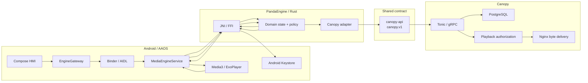
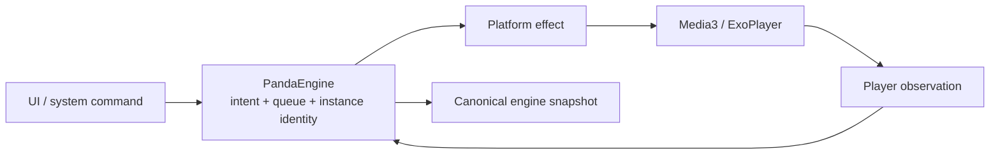

<div align="center">

# 🐼 PandaWave

### Android Automotive media at the surface. Explicit systems boundaries underneath.

[](https://developer.android.com/training/cars)
[](https://kotlinlang.org/)
[](https://www.rust-lang.org/)
[](https://github.com/adrianrusu16/PandaWave/actions/workflows/ci.yml)

[Case study](https://adrianrusu.dev/projects/pandawave/) ·
[Architecture](docs/architecture-roadmap.md) ·
[Testing](docs/testing.md) ·
[Canopy](https://github.com/adrianrusu16/Canopy) ·
[canopy-api](https://github.com/adrianrusu16/canopy-api)

</div>

---

**PandaWave** is an Android Automotive OS media application built around a Kotlin / Jetpack Compose HMI, Android Media3 and a Rust source-of-truth engine called **PandaEngine**.

The project is deliberately split across platform, process and network boundaries:

> **Android owns the vehicle and platform surfaces. PandaEngine owns client-domain decisions. Canopy owns backend policy and durable data.**

PandaEngine communicates with the **Canopy** backend over gRPC through the versioned public [`canopy-api`](https://github.com/adrianrusu16/canopy-api) contract.

> **Status:** active personal project. Architecture, platform integration and product work are developed incrementally so changes remain independently reviewable and testable.

---

## 🎛️ What PandaWave explores

| Area | Focus |
|---|---|
| 🚗 **AAOS HMI** | Automotive-first navigation, restrictions, focus/rotary behavior and platform media integration |
| 🎵 **Media** | Media3 / ExoPlayer, MediaSession, queues, transport controls and system surfaces |
| 🔀 **Process boundary** | Binder/AIDL service boundary between the Android app process and engine process |
| 🦀 **Native domain engine** | Rust/PandaEngine state ownership, playback intent, session coordination and backend mapping |
| 🔌 **Native bridge** | JNI/FFI between Android and Rust |
| ☁️ **Backend contract** | gRPC / Protobuf through the independently versioned `canopy-api` |
| 🔐 **Session security** | Rust-owned session semantics with a narrow Android Keystore cryptographic adapter |
| 🎨 **OEM customization** | Resource-driven design tokens and Runtime Resource Overlays |
| 📈 **Performance** | Macrobenchmark / Perfetto-oriented investigation and explicit performance boundaries |

---

## 📸 Running on AAOS

<table>
  <tr>
    <td align="center"><strong>Home</strong><br/></td>
    <td align="center"><strong>Now Playing</strong><br/></td>
  </tr>
  <tr>
    <td align="center"><strong>Library / History</strong><br/></td>
    <td align="center"><strong>Search</strong><br/></td>
  </tr>
  <tr>
    <td align="center"><strong>Authenticated Profile</strong><br/></td>
    <td align="center"><strong>AAOS system integration</strong><br/></td>
  </tr>
</table>

The launcher, status bar, HVAC and other vehicle/system surfaces shown around the app are rendered by the AAOS platform. PandaWave supplies its media/session integration and app identity to those system-owned surfaces.

---

## 🧭 Architecture



### Ownership at a glance

| Component | Owns |
|---|---|
| **Compose / app shell** | presentation, navigation and automotive UX |
| **MediaEngineService / AIDL** | Android process boundary and engine hosting |
| **JNI / FFI** | narrow Kotlin ↔ Rust transport |
| **PandaEngine** | client-domain state, queue semantics, playback intent, backend mapping and session coordination |
| **Media3** | actual platform playback execution and observed player facts |
| **canopy-api** | canonical versioned Protobuf/gRPC contract |
| **Canopy** | identity, persistent metadata, authorization policy and playback-source resolution |

The maintained architecture detail lives in [`docs/architecture-roadmap.md`](docs/architecture-roadmap.md).

---

## ▶️ Playback: intent vs observation

PandaWave intentionally separates a playback request from the eventual platform observation.



Each load receives an engine-created playback instance identity. A late observation from a superseded load is rejected instead of overwriting the current state.

This keeps the domain model from treating asynchronous player callbacks as automatically authoritative.

---

## 🔐 Secure-session boundary

Rust owns client auth state, session rotation and persistence policy.

Android owns only the platform cryptographic operation:

```text
Rust session material
        ↓
secure-storage adapter
        ↓
Android Keystore AES-GCM key
        ↓
encrypted session envelope
        ↓
Rust-owned file persistence
```

The Keystore key material is never exported to Rust or ordinary Kotlin callers.

See [`docs/secure-storage.md`](docs/secure-storage.md).

---

## 🧪 Evidence & validation

PandaWave separates validation into host-side and Android/device lanes.

Examples already represented in the repository include:

- Kotlin/JVM behavior tests;
- Rust tests;
- Android instrumentation;
- a process-recovery regression test that kills the exact `:engine` process and verifies reconnect/recovery through Binder;
- a MediaBrowser smoke test against the real `MediaLibraryService`;
- opt-in live Canopy integration tests;
- benchmark/performance infrastructure;
- CI build/lint/test lanes.

See [`docs/testing.md`](docs/testing.md) for the maintained test model.

---

## 🧰 Stack

| Layer | Technology |
|---|---|
| Platform | Android Automotive OS |
| Android | Kotlin, Jetpack Compose |
| Media | AndroidX Media3 / ExoPlayer |
| IPC | Binder / AIDL |
| Native | JNI / Rust FFI |
| Domain engine | Rust / Tokio |
| Backend transport | gRPC / Tonic / Prost |
| API | Protobuf via `canopy-api` |
| Backend | Canopy / Rust |
| Persistence | PostgreSQL |
| Media delivery | Nginx |
| Secure local crypto | Android Keystore |
| Build | Gradle + Cargo |
| OEM theming | Android resources + RRO |
| Performance | Macrobenchmark / Perfetto-oriented tooling |

---

## 🗂️ Repository structure

```text
PandaWave/
├── app/                  Android application entry point
├── feature/              Compose feature modules
├── core/                 Android platform, UI and engine-boundary modules
├── rust/
│   └── engine/           PandaEngine Rust workspace
├── benchmark/            Benchmark / performance infrastructure
├── rro/                  Runtime Resource Overlay project(s)
├── build-logic/          Gradle convention plugins and checks
├── config/               Project configuration
├── scripts/              Integration / verification helpers
└── docs/                 Maintained architecture and engineering documentation
```

For module detail, see [`docs/module-structure.md`](docs/module-structure.md).

---

## 📚 Documentation

### Architecture
- [Architecture Roadmap](docs/architecture-roadmap.md)
- [Native Engine Host — AIDL / JNI / Rust](docs/native-engine-host.md)
- [Android Platform Integration](docs/android-platform-integration.md)
- [Module Structure](docs/module-structure.md)
- [AAOS Supported ABIs](docs/aaos-supported-abis.md)

### Backend / contract
- [Canopy Backend Integration](docs/canopy-backend-integration.md)
- [Local Canopy Integration](docs/canopy-local-integration.md)
- [Canopy SDK Upgrades](docs/canopy-sdk-upgrades.md)

### OEM / presentation
- [RRO Design Tokens](docs/rro-design-tokens.md)
- [Assets and Branding](docs/assets-and-branding.md)

### Quality / performance
- [Testing](docs/testing.md)
- [Observability](docs/observability.md)
- [Build Performance](docs/build-performance.md)
- [CI Performance](docs/ci-performance.md)
- [Performance Documentation](docs/performance/)

---

## 🚀 Development

### Prerequisites

A typical development environment requires:

- Android Studio;
- Android SDK with an AAOS emulator/image;
- the JDK version used by the project's Gradle setup;
- Rust toolchain;
- Android Rust targets/tooling used by the native-engine build;
- a compatible Canopy backend for backend-backed flows.

### Build

```bash
./gradlew assembleDebug
```

### Test

The repository has separate Rust, JVM, instrumentation, integration and performance-oriented lanes.

Start with:

```text
docs/testing.md
```

### Local Canopy

See:

- [`docs/canopy-local-integration.md`](docs/canopy-local-integration.md)
- [`docs/canopy-backend-integration.md`](docs/canopy-backend-integration.md)

---

## 🌲 Related repositories

| Repository | Role |
|---|---|
| [`Canopy`](https://github.com/adrianrusu16/Canopy) | Rust/Tonic backend and policy authority |
| [`canopy-api`](https://github.com/adrianrusu16/canopy-api) | Public canonical `canopy.v1` Protobuf/gRPC source contract; generated SDK distribution is versioned independently |

---

## 🧠 Project principles

1. Keep the Android HMI reactive.
2. Keep client-domain ownership in PandaEngine.
3. Keep backend/protobuf details behind the Rust adapter.
4. Treat Media3 as the platform player, not the domain source of truth.
5. Fail closed for authentication and session persistence.
6. Make asynchronous identity/race behavior explicit.
7. Treat automotive restrictions as product requirements.
8. Measure performance instead of inventing performance claims.
9. Keep architectural migrations independently reviewable.
10. Keep detailed engineering material in `docs/`; keep the README as the fast path.

---

<div align="center">

**Want the guided version?**

[Explore the PandaWave case study →](https://adrianrusu.dev/projects/pandawave/)

</div>
